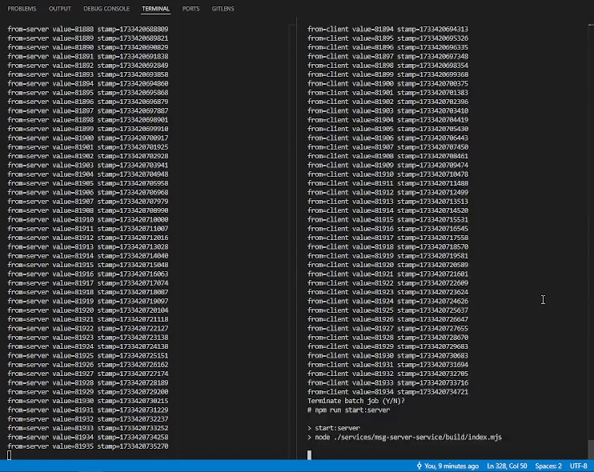

# 🔥 node-grpc-stream-queue

> Enables reliable bidirectional gRPC streaming with automatic retries, message queuing, error handling, and logging, supporting real-time communication between distributed services in a robust and fault-tolerant manner.



## Usage

```bash
npm install
npm run build
node .\services\msg-client-service\build\index.mjs
node .\services\msg-server-service\build\index.mjs
```
